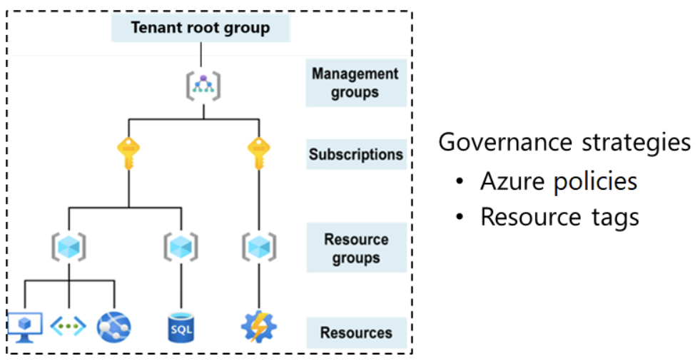
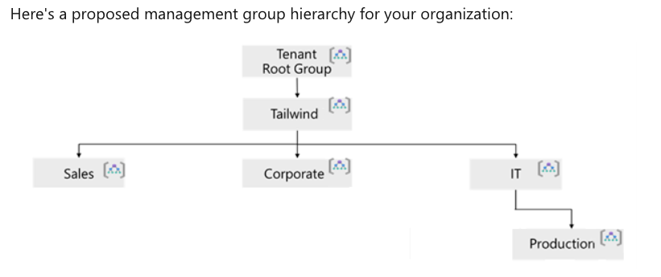
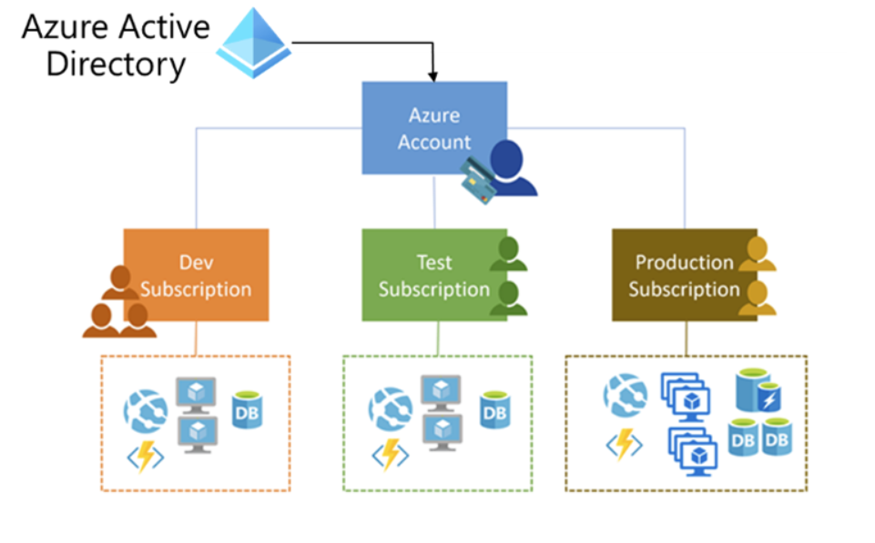

## Design Governance
Governance provides mechanisms and processes to maintain control over your application and resouce in Azure. 
it involves determining your 
- Requirements
- planning your initiatives
- setting strategic priorites

A typical Azure hierarchy has four levels
- **Management Groups** which helps you manage access, policy and compliance for multiple subscriptions
- **Subscription** are logical containers that serves as unit of management and scale. Subs are also billing boundries.
- **Resource Groups** are logical containers into which Azure resource are deployed and managed
- **Resources** are instances of services that you create. For example.
    - Virtucal Machines
    - Storage
    - SQL databases

### Design for Management Groups

Things to consider when creating management groups
**Tailwind Traders** has 
- *Sales*, 
- *Corporate*, 
- *Information Technology (IT)* departments. 
The *Sales department* manages offices in the **West** and in the **East**. 
The *Corporate main office* includes **Human Resources (HR)** and **Legal**. 
The *IT department* handles **research**, **development**, and **production**. There are currently two applications hosted in Azure.

## Design for subscriptions

To use Azure you must have an Azure subscriptions
Serveral types of subscriptions
- Enterprise Agreement
- Pay-as-you-go

### Charactristics of subscriptions
- provide separate billing envrionemtns such as dev, test and prod
- Polices for individual subs can help satisfy different compliance standards
- You can organize specialized workloads to scale beyond the limits of an existing subscription
- You can manage cost for your org structure

