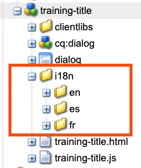
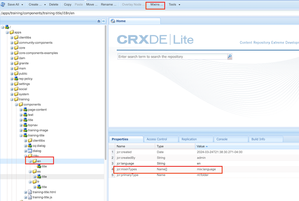
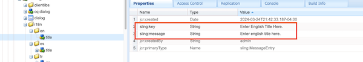

## How to add language option with custom component using CRXDE
***Scenario*** Adding three language option with your custome component. ***English***, ***Spanish*** and ***French***.

Create **i18n** folder in your component.
Create ***Subfolders*** for each languages within ***i18n***
**en**
**es**
**fr**
Component structure will look like this 👇

Add Mixins.. to these folders with **type** ***mix:language***

After adding mixins. Add a property called ***jcr:language*** with language ***iso code*** i.e **french it will be fr**

Within those folder **create node** with exect same name as an item in your component with ***primaryType: sling:MessageEntry***
Now add two properties
1. sling:key
2. sling:message
Sling:key is ***same*** for all language and change the ***sling:message*** properties with your desire custom value in each language.

**Test**
Change the prefered language from profile->prefrences and check in the component weather the lang is chages to your custom meesage attached to the lanaguage.