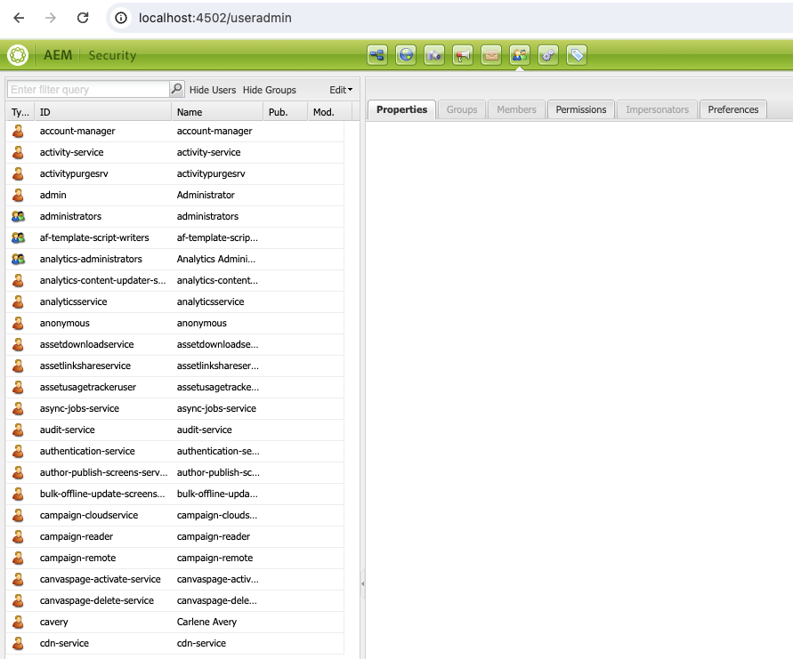
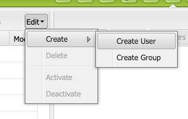
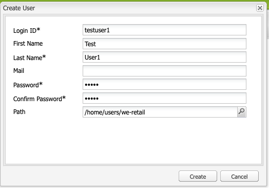
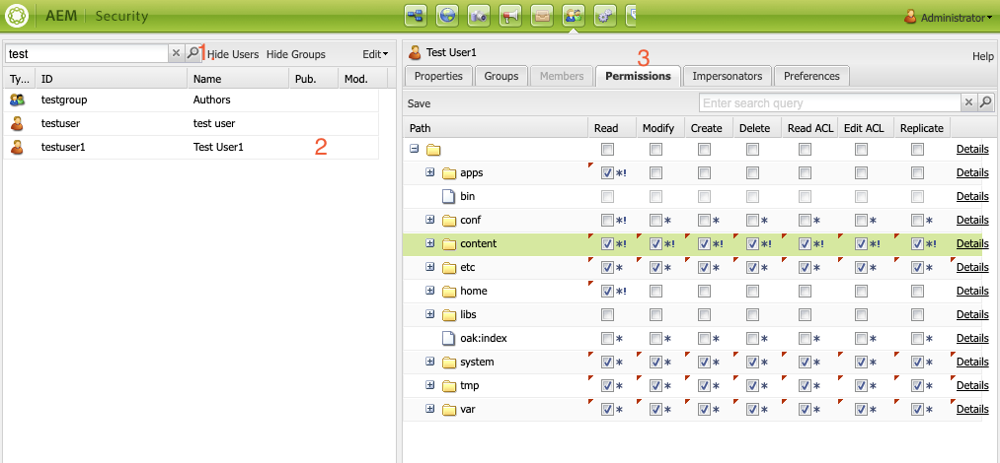
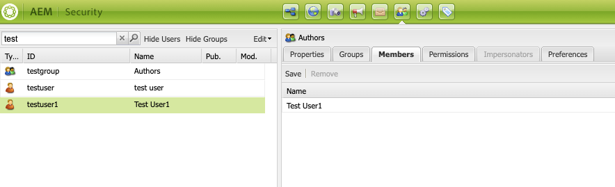

## How to setup user and user group in AEM using AEM siteadmin console.

First access to your siteadmin console. [http://localhost:4502/siteadmin](localhost:4502/siteadmin)

select **Edit-->Create-->Create User** option to create new user

Fill out user details for a new user and select create to **create new user**.

After creating an user set user permission. for exmaple, below screenshot showing **user permission** for **Content Author role**.

1. Search user you want to set permission for in serach bar.
2. Select and double click on user
3. Go to permission tab

the option selected for the user is for **Content Author** role

Similarly, the group can be created.
**Edit --> Create --> Create Group**

*So in real world scenarions.* You can create group. Set different permission as per the roles within an organization and after that you create users and assign group to the user.

**To add users to the group.**
1. Search group you want to add users in serach bar.
2. Select and double click on group
3. Go to Members tab and drag and drop user to the right members area and press Save.

This is basics on how can you create users and groups and manage their permissions

Ref: [Official detials documentation.](https://experienceleague.adobe.com/en/docs/experience-manager-65/content/forms/administrator-help/setup-organize-users/adding-configuring-users)